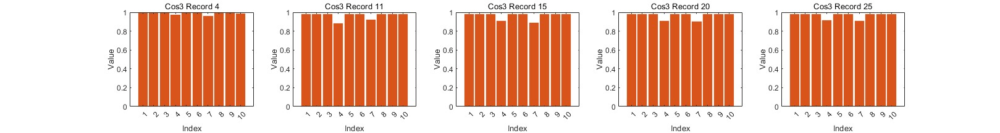
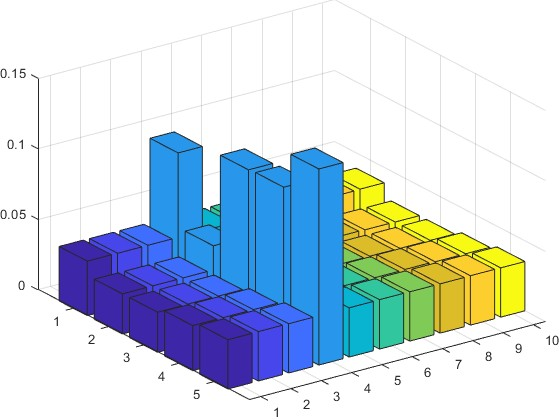
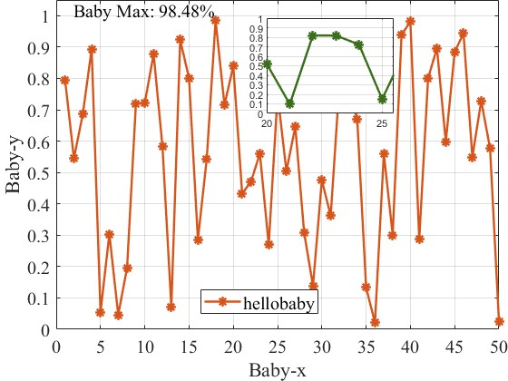

# 柱状图（bar）
只介绍纵向的

## 2d柱状图

file:`bar_2d.m`

* 'FaceColor'：柱状图里面的颜色
* 'EdgeColor'：柱状图边框的颜色
* 'LineWidth'：柱状图边框粗细

## 2d柱状图

file:`bar_3d.m`

选择数据到一个数组里面然后直接bar3

# 折线图（plot）

file:`line_graph.m`

用于画趋势图，例如：acc、loss.... 

**额外功能：找出最大值并标出来、画“图中图”用于放大细微部分**

